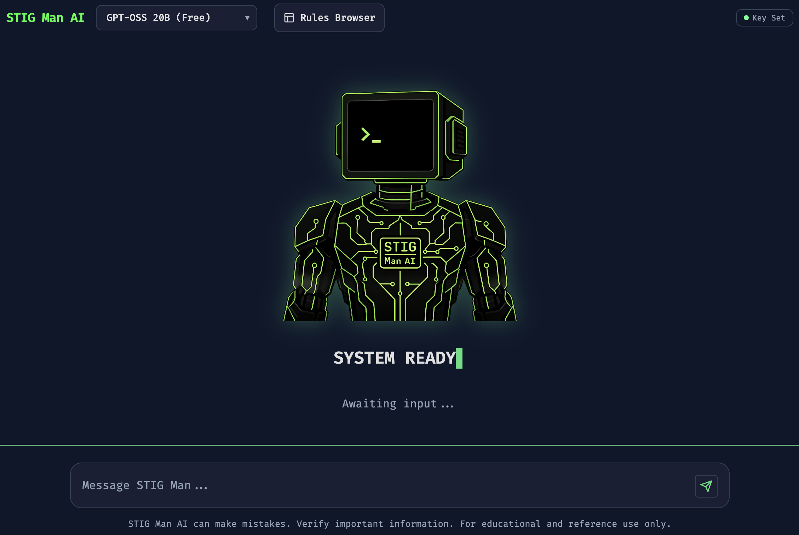
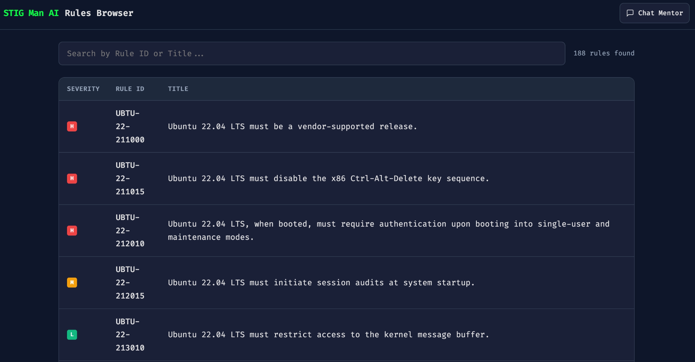
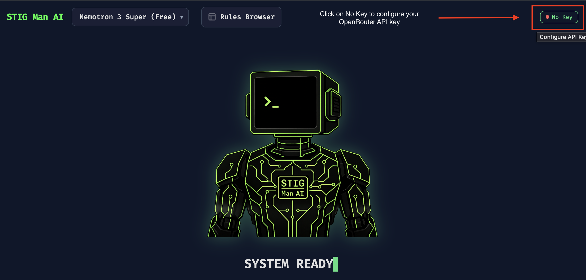
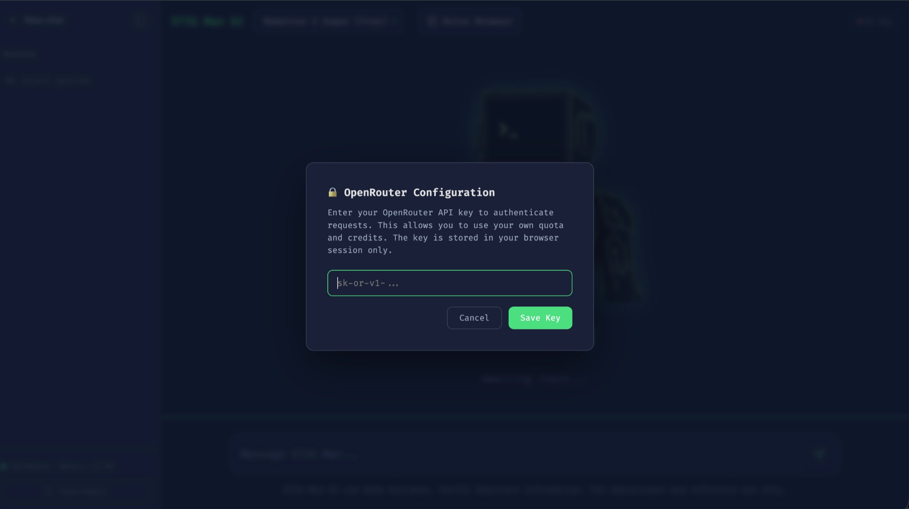

# STIG Man AI - RAG Application Report

## 1. Executive Summary



**STIG Man AI** is a production-grade Retrieval-Augmented Generation (RAG) application designed to serve as an intelligent assistant for cybersecurity technicians and system administrators. The application specializes in parsing, indexing, and interpreting Defense Information Systems Agency (DISA) Security Technical Implementation Guides (STIGs).

By combining a hybrid retrieval engine with state-of-the-art Large Language Models (LLMs), STIG Man AI transforms complex, low-level XCCDF XML requirements into clear, actionable, and human-readable guidance.

**Key Capabilities:**
* **Natural Language Interpretation:** Simplifies dense technical requirements into 8th-grade level English.
* **Guarded Retrieval Engine:** Uses a strict regex guardrail to enforce official STIG ID lookups, ensuring 100% precision and zero-noise retrieval.
* **Rules Browser:** A centralized interface for exploring the entire library of indexed security controls.
* **Multi-Model Flexibility:** Support for various LLMs (Gemma, Llama, Nemotron, etc.) via the OpenRouter API.
* **Hardened Security:** Built-in rate limiting, security headers, and XXE-protected XML parsing.

**Target Users:**
* Junior Cybersecurity Technicians
* System Administrators (Linux/Ubuntu)
* Anyone looking to learn about STIGs

---

## 2. Problem Statement

Cybersecurity compliance often revolves around **DISA STIGs**, which are provided as massive XCCDF XML files. These files present several challenges:
1. **Complexity:** XML files are difficult for humans to read and navigate without specialized tools (like STIG Viewer).
2. **Jargon Overload:** Requirements are often written in dense, bureaucratic language that can be misinterpreted by junior staff.
3. **Searchability:** Standard search tools often fail to find relevant rules when the user doesn’t know the exact Rule ID or keyword.
4. **Actionability:** While STIGs provide “Fix Text,” they rarely explain the *why* or provide real-world context for the security risk in a way that resonates with technicians.

Traditional approaches rely on manual lookups and static documentation, which are slow, error-prone, and fail to provide the interactive “mentorship” needed to scale security operations.

---

## 3. Solution Overview

STIG Man AI solves these problems by implementing an **RAG Pipeline**. Instead of relying on a model’s static training data—which may be outdated or hallucinate specific compliance requirements—the application dynamically retrieves the ground-truth STIG text and provides it to the LLM as context.

**Key Advantages:**
* **Zero Hallucination (Strict Grounding):** The system prompt explicitly forbids the LLM from using outside knowledge, ensuring responses are 100% compliant with the provided STIG data.
* **Persona-Driven Explanations:** The “Mentor” persona translates high-level risks into simple terms, making compliance accessible to non-experts.
* **RAG vs. Fine-Tuning:** RAG was chosen over fine-tuning because STIGs files are publicly available for download from the DoD’s cyber.mil and can be easily parsed for this application.

---

## 4. System Architecture

The application follows a modular, three-tier architecture designed for scalability and security.

### High-Level Architecture Diagram

```
      +-----------------------------------------------------------+
      |                   USER INTERFACE (Browser)                |
      |          (Vanilla JS / HTML5 / Terminal CSS)              |
      +-----------------------------+-----------------------------+
                                    |
                                    v [REST API / JSON]
      +-----------------------------------------------------------+
      |                  FASTAPI BACKEND (Python)                 |
      |   +---------------------------------------------------+   |
      |   |  HYBRID RETRIEVAL ENGINE                          |   |
      |   |  - Exact ID Lookup (In-Memory Dictionary)         |   |
      |   |  - Semantic Search (ChromaDB Vector Store)        |   |
      |   |  - Reranker (Cross-Encoder/MiniLM)                |   |
      |   +--------------------------+------------------------+   |
      |                              |                            |
      |   +--------------------------v------------------------+   |
      |   |  LLM INTERFACE (OpenRouter)                       |   |
      |   |  - Persona: Cybersecurity Mentor                  |   |
      |   |  - Format: Structured JSON                        |   |
      |   +---------------------------------------------------+   |
      +-----------------------------+-----------------------------+
                                    |
            +-----------------------+-----------------------+
            |                                               |
   +--------v--------+                            +---------v---------+
   |   DATA LAYER    |                            |  VECTOR STORAGE   |
   | (STIG XML Files)|                            |    (ChromaDB)     |
   +-----------------+                            +-------------------+
```

### Component Breakdown:

- **Frontend:** A lightweight, SPA-style interface using vanilla JavaScript and CSS. It features a modern terminal aesthetic and handles API-key session management.
- **Backend/API Layer:** A FastAPI server that handles orchestration. It manages the lifespan of services, rate limiting via SlowAPI, and serves the static frontend assets.
- **Hybrid Storage:** A custom implementation that maintains an in-memory dictionary for O(1) exact match lookups and a ChromaDB instance for high-dimensional vector search.
- **RAG Pipeline:** The core logic that bridges retrieval and generation, ensuring context is correctly formatted for the LLM.
- **LLM Integration:** Connects to OpenRouter, allowing users to choose their preferred model and use their own API keys.

---

## 5. RAG Pipeline Deep Dive

The STIG Man AI pipeline is a multi-stage process designed to ensure the highest possible retrieval accuracy.

1. **Data Ingestion:**
    - The system monitors specific directory for the STIG XCCDF `.xml` files.
    - A hardened `lxml` parser extracts `Rule`, `Group`, and `Version` elements.
    - Security Note: The parser is configured to block XML External Entity (XXE) attacks.
2. **Chunking Strategy:**
    - Unlike traditional RAG which splits documents by character count, this app uses **Atomic Rule Chunking**. Each STIG Rule is treated as a single, unbreakable unit (including its ID, Title, Severity, Check Text, and Fix Text) to ensure the LLM never loses the context of a requirement.
3. **Embedding Generation:**
    - Text chunks are converted into 384-dimensional vectors using the `all-MiniLM-L6-v2` transformer model. This model is small and fast, making it ideal for local deployment.
4. **Storage Mechanism:**
    - Embeddings and full metadata are stored in **ChromaDB**.
    - On startup, the system “hydrates” an in-memory dictionary from the vector store to enable instant ID-based lookups without querying the database.
5. **Retrieval Logic:**
    - **Step 1 (Format Validation):** Every query is passed through a strict Regex validator (`^UBTU-22-\d{6}$`). This acts as the primary guardrail; any natural language or alternative IDs (like `V-XXXXX`) are rejected before they reach the engine.
    
    
    
    - **Step 2 (High-Precision Lookup):** The system performs an O(1) lexical lookup in the in-memory index using the validated STIG ID. This ensures the response is mapped directly to the official DISA requirement.
    - **Step 3 (Zero-Hallucination Policy):** If a valid-format ID is entered but does not exist in the indexed STIG data, the system is designed to fail safely. Instead of attempting a “semantic best guess,” it returns a standard “I don’t know” response to prevent providing inaccurate security guidance.
    
    
    
    <aside>
    
    `UBTU-22-215031` is not a real STIG rule ID. The LLM outputs “I don’t know…”
    
    </aside>
    
6. **Prompt Construction:**
    - The system assembles a prompt focused on the **verified primary match** retrieved during the lexical lookup.
    - Context is injected with clear "Ground Truth" markers, instructing the AI to ignore any internal knowledge.
    - Strict instructions enforce an 8th-grade reading level and a JSON-only response format to ensure UI consistency.
7. **Response Generation:**
    - The LLM  generates a structured JSON object.
    - The backend parses this JSON and returns it to the frontend for specialized rendering (e.g., displaying fix steps as a numbered list).

---

## 6. Key Features

### User-Facing Features:

- **Interactive Chat:** ChatGPT-style interface for querying security rules.


- **Rules Browser:** A searchable table of every rule indexed in the system, with detailed modal views.



- **Model Selector:** Toggle between various models (Gemma, Llama, GPT-OSS, Nemotron) based on preference for speed or reasoning depth.
- **Terminal Aesthetic:** High-contrast, hacker-friendly UI with Fira Code typography.
- **History Management:** Persistent sidebar tracking of previous queries within a session.

### System-Level Capabilities:

- **Auto-Hydration:** Automatically reloads its database on startup from persisted storage.
- **Rate Limiting:** Protects the API and LLM quota from abuse (15 requests per minute).
- **Cross-Origin Support:** Configurable CORS for secure deployment.
- **Structured Output:** Every AI response is validated as JSON before being sent to the client.

---

## 7. How to Use the Application

### End User Guide

1. **Configure API Key:** Click the “No Key” button in the header and enter your OpenRouter API Key.





1. **Select a Model:** Choose a model from the dropdown (e.g., `GPT-OSS, etc.`).
2. **Enter a Query:**
    - **Exact ID:** Typed in this format `UBTU-22-XXXXXX` to get an explanation.


**`root@stig-man-ai` will output:**

- **Explanation:** Simple breakdown of the rule.
- **Why it matters:** how does this rule decrease the attack surface.
- **Real-World Example:** A scenario showing why the rule matters.
- **Fix Steps:** Instructions to harden the system for that specific rule.

### Quick Start (using Docker Hub)

1. **Run the Container:**

```bash
# Step 1: Download the latest version from Docker Hub
docker pull stigman01/stig-man-ai:latest

# Step 2: Run it (This creates a container named 'stigmanAI')
docker run -d --name stigmanAI -p 8000:8000 stigman01/stig-man-ai:latest

```

**2. The Next Time (Daily Use)**

Once the container exists, you don't need to "run" it again (which would try to create a duplicate). You just start the one you already made.

**To Start it:**

```bash
docker start stigmanAI
```

**To Stop it:**

```bash
docker stop stigmanAI
```

1. **Access the App:** Open your browser to `http://localhost:8000`.


---

## 8. Security & Performance Considerations

- **Data Handling:** The application does not store user queries or API keys on the server. Keys are stored in the user’s browser `localStorage` or `sessionStorage`.
- **API Security:** The `/query` endpoint requires a valid `X-API-Key` header, acting as a gateway to prevent unauthorized LLM usage.
- **Performance:**
    - **Embeddings:** The `MiniLM` model is CPU-friendly and generates embeddings in milliseconds.
    - **Concurrency:** FastAPI handles asynchronous requests, allowing multiple users to query the LLM simultaneously without blocking.
- **Scalability:** The system can be scaled horizontally by putting the `chroma_db` on a shared volume, though it is currently optimized for a single-container deployment.

---

## 9. Conclusion

**STIG Man AI** represents a significant leap forward in cybersecurity compliance tooling. By abstracting the complexity of DISA STIGs through a RAG-powered mentor, it empowers junior staff to perform expert-level security hardening. The application’s blend of high-precision retrieval, simple language generation, and robust security architecture makes it a valuable asset for any organization maintaining secure Linux environments.


**Disclaimer**
**STIG Man AI** can make mistakes like any other AI product. Please verify important information.
For educational and reference use only.
